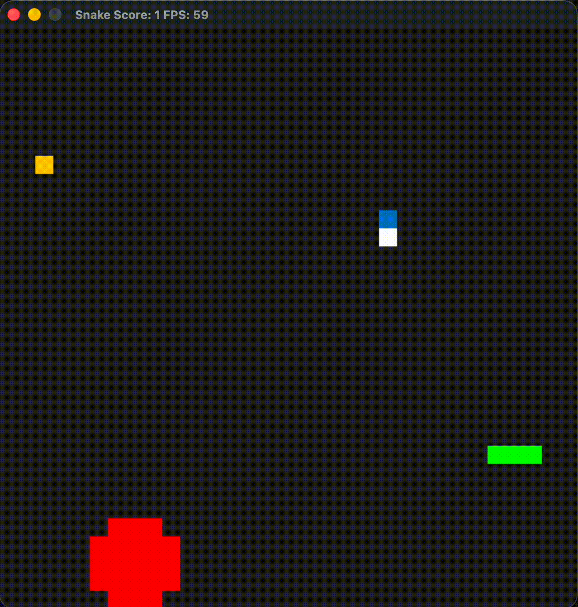

# C++ Capstone Project: Thread-Optimized Multithreaded Snake Game

This is a highly optimized, multithreaded classic Snake Game implementation completed as the Capstone Project for the Udacity C++ Nanodegree Program. 

The project has been refactored from the baseline single-snake starter repository to feature a dynamic moving obstacle system (incorporating real-time state oscillations like an animated Pacman), a smart non-colliding AI enemy snake utilizing an optimized toroidal A* Search algorithm, thread-safe functor-based asynchronous task parallelization, and a centralized configuration management system.

---



## 🎮 Features & Expected Behavior

1. **Dual Snake Engine:** 
   - **Player Snake:** Controlled using the standard keyboard arrow keys.
   - **AI Snake:** Dynamically calculates and pursues the shortest path to the food in real-time. It uses an active **Toroidal A* Pathfinding search** to navigate, allowing it to intelligently wraps around the screen boundaries if going through a wall is the more efficient path.
2. **Dynamic Animated Obstacles (Pacman):**
   - Spawns an animated Pacman obstacle that walks around randomly in cardinal directions.
   - Pacman’s mouth procedurally opens and closes based on his active direction of travel.
   - Other static/moving layout profiles can also be rendered (e.g. Wolf Head, Cross, Gateway, Hollow Frame).
3. **Task-Based Parallel Loop Execution:**
   - Leveraging `std::async`, entity transformations (Snake movement, AI Snake movement, and Pacman updates) as well as non-blocking read-only cell collision calculations are performed concurrently on separate threads.
4. **Permanent Scoreboards & User Profiling:**
   - Prompts players for their name on start, reads previous high scores from local disk files (`scores.txt`), saves new records on gracefully shutting down, and verifies game stats dynamically.

---

## 📦 Prerequisites (Cross-Platform)

The game requires **CMake**, a C++17 compliant compiler, and the **SDL2** development libraries.

### macOS
Install SDL2 using Homebrew:
```bash
brew install cmake sdl2
```

### Windows (MSYS2 / MinGW)
Install CMake and SDL2 dependencies:
```bash
pacman -S mingw-w64-x86_64-cmake mingw-w64-x86_64-SDL2
```

### Linux (Ubuntu/Debian)
```bash
sudo apt-get update
sudo apt-get install -y cmake libsdl2-dev
```

---

## 🚀 Building and Running

Ensure you are in the root directory.

1. **Create the build folder and generate Makefiles via CMake:**
   ```bash
   mkdir -p build && cd build
   cmake ..
   ```
2. **Compile the executable:**
   ```bash
   make
   ```
3. **Execute the binary:**
   ```bash
   ./SnakeGame
   ```

---

## 🏆 Addressing Rubric Criteria

This project meets the requirements of the C++ Capstone rubric. Below is the mapping of each addressed rubric criteria to the files and line ranges in the codebase.

### 📑 1. Loops, Functions, I/O

| Rubric Criteria | Description | File / Methods / Details |
| :--- | :--- | :--- |
| **C++ Functions and Control Structures** | Code clearly organized into functions with structural control loops. | • Organized cleanly across classes (e.g. `Game`, `AIController`, `Obstacle`).<br>• Code uses standard `while`, `for`, `switch` statements (e.g., `Obstacle::BuildPacman` and `Astar::Search`). |
| **Reads and Writes Local Files**| Reads data from an external file and/or writes out data to a disk file. | • **File**: `src/score.cpp`<br>• **Method**: `Score::update_score()` reads prior scores; `Score::write_score_to_unmanaged_file()` writes new score registers to `scores.txt`. |
| **Accepts and Processes User Input** | Receives and processes custom user keyboard and console inputs. | • Prompting player name on console stream in `Game::Run()` via `std::getline(std::cin, name)` (`src/game.cpp`).<br>• Steering inputs caught via keyboard scan in `Controller::HandleInput` (`src/controller.cpp`). |
| **Data Structures and Constants** | Use of arrays, vectors, and constant immutable variables. | • Centralized local constant table namespace `Config` in `src/config.h`.<br>• Uses vectors for coordinate mapping: `std::vector<SDL_Point>` in `src/block.h`, and `std::vector<std::vector<State>>` in `src/astar.h`. |

---

### 🎨 2. Object Oriented Programming

| Rubric Criteria | Description | File / Methods / Details |
| :--- | :--- | :--- |
| **Class Access Specifiers** | Logical segregation of attributes into `public`, `protected`, and `private`. | • **File**: `src/block.h` (Base coordinates under `protected`, public operations under `public`).<br>• **File**: `src/game.h` has references safely hidden behind `private`. |
| **Member Initialization Lists** | Constructor uses member initialization lists. | • **File**: `src/block.h` (constructor initialized from lists).<br>• **File**: `src/game.cpp` (Game initializer sets up pointers directly). |
| **Documentation of Interfaces** | Classes abstract details; functions explicitly document side-effects. | • Clear class declarations with robust naming conventions separating public helper interfaces from inner workings (`src/ai_controller.h`, `src/astar.h`). |
| **Class Inheritance Hierarchy** | Logical polymorphism override patterns using `virtual` and `override`. | • **File**: `src/block.h` serves as an abstract base class declaring a pure virtual function: `virtual void Update() = 0;`. <br>• **Files**: `src/snake.h` and `src/obstacle.h` inherit from `Block` and define `void Update() override;`. |

---

### 💾 3. Memory Management

| Rubric Criteria | Description | File / Methods / Details |
| :--- | :--- | :--- |
| **Use of References** | Functions explicitly pass arguments by reference to eliminate copy overhead. | • **File**: `src/ai_controller.cpp`<br>• **Method**: `AIController::MoveAISnake(Snake &ai_snake, const SDL_Point &food, const std::vector<std::vector<State>> &grid)` passes objects as parameters by reference. |
| **Smart Pointers instead of Raw Pointers** | Leverage smart resource ownership semantics instead of standard raw heap allocations. | • **File**: `src/game.h` uses safe automated smart pointers: `std::unique_ptr<Snake> snake`, `std::unique_ptr<Snake> ai_snake`, and `std::unique_ptr<Obstacle> obstacle`. |
| **Use of Scope & RAII Pattern** | Object destruction tied strictly to scope lifecycle of their constructors/destructors. | • Clean automatic garbage disposal of STL containers, SDL textures / screens, smart pointer instances, and file frames as scopes terminate. |

---

### 🚦 4. Concurrency

| Rubric Criteria | Description | File / Methods / Details |
| :--- | :--- | :--- |
| **Multithreading & Async Tasks** | Multi-threaded design using distinct asynchronous units. | • **File**: `src/game.cpp`<br>• **Method**: `Game::Update()` concurrently processes AI movement and Pacman animations in separate threads using `std::async`. |
| **Promises and Futures** | Passing values thread-to-thread using futures. | • **File**: `src/game.cpp`<br>• **Method**: `Game::PlaceFood()` launches simultaneous asynchronous queries via the `Block` functor and retrieves execution checks from their `std::future<bool>` values using `.get()`. |


## CC Attribution-ShareAlike 4.0 International


Shield: [![CC BY-SA 4.0][cc-by-sa-shield]][cc-by-sa]

This work is licensed under a
[Creative Commons Attribution-ShareAlike 4.0 International License][cc-by-sa].

[![CC BY-SA 4.0][cc-by-sa-image]][cc-by-sa]

[cc-by-sa]: http://creativecommons.org/licenses/by-sa/4.0/
[cc-by-sa-image]: https://licensebuttons.net/l/by-sa/4.0/88x31.png
[cc-by-sa-shield]: https://img.shields.io/badge/License-CC%20BY--SA%204.0-lightgrey.svg
